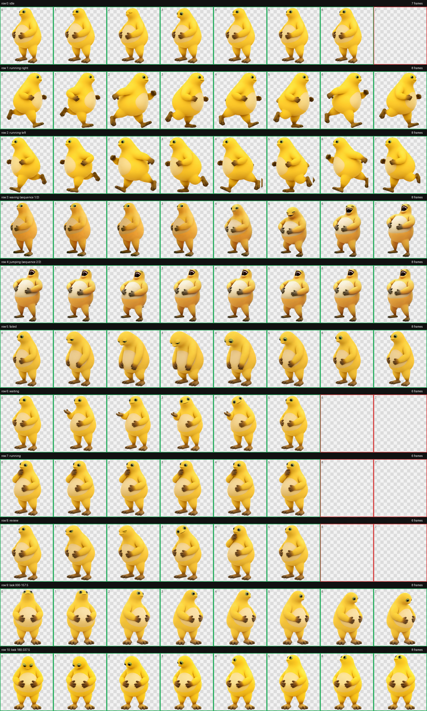
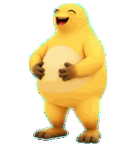
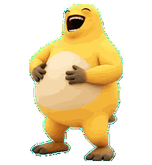
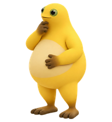

# 奶蛙 NaiWa · Codex 桌面宠物

一个为 Codex 桌面应用制作的自定义 v2 动画宠物。角色采用圆润的奶黄色 3D 玩具风格，包含待机、跑步、等待、完成反馈、方向注视、参考动作视频还原的“捧腹大笑”交互，以及 Codex 思考处理时显示的静态托腮姿势。

> 这是非官方的同人桌宠项目，与 OpenAI 或相关角色权利方无隶属、授权或背书关系。



## 动画预览

| 招呼 / 交互大笑 | 鼠标进入 / 跳跃状态大笑 | 思考处理中（静态） |
| --- | --- | --- |
|  |  |  |

大笑 GIF 展示图集中的完整素材序列；桌面应用实际播放的帧数与持续时间受客户端限制，详见下方说明。

## 功能

- 休息、呼吸和眨眼待机动画
- 向左、向右跑步动画
- 常规工作、等待、失败和完成反馈
- 16 个注视方向
- row3 + row4 保存 16 帧连续大笑素材；当前客户端的 `waving` 与 `jumping` 分别播放其中 4 帧和 5 帧
- 16 帧直接取自 592 × 1280 原视频，统一等比缩放，保留原人物身材比例
- 原视频白底经综合色光反算去污染，使用预乘 Alpha 等比缩放；锐化仅作用于不透明内部，避免白边与锯齿
- Codex 思考处理对应的 `running` 状态使用静态托腮姿势，六个有效格逐像素相同
- 托腮姿势在播放期间保持静止；当前客户端播放三轮后会回到待机，尚未实现任务运行期间持续托腮
- 透明背景、无阴影残留，适合直接作为 Codex v2 宠物图集

## 安装

### 方法一：下载仓库

1. 下载本仓库并解压。
2. 在 `%USERPROFILE%\.codex\pets\` 下新建 `naiwa-laugh-v4` 文件夹。
3. 将仓库根目录的 `pet.json` 和 `spritesheet.webp` 复制到该文件夹。
4. 打开 Codex 的 **Settings → Pets**，点击 **Refresh**。
5. 选择 **奶蛙 NaiWa（大笑与思考版）**。

### 方法二：PowerShell

```powershell
git clone https://github.com/Swordmynew/naiwa-petdex.git

$target = Join-Path $env:USERPROFILE ".codex\pets\naiwa-laugh-v4"
New-Item -ItemType Directory -Force -Path $target | Out-Null
Copy-Item -LiteralPath ".\naiwa-petdex\pet.json" -Destination $target -Force
Copy-Item -LiteralPath ".\naiwa-petdex\spritesheet.webp" -Destination $target -Force
```

复制完成后，仍需在 Codex 的宠物设置中刷新并选择奶蛙。更多说明参见 [Codex Pets 官方文档](https://learn.chatgpt.com/docs/pets?translationFallback=zh-Hans)。

## 图集规格

| 项目 | 值 |
| --- | --- |
| 格式 | Codex pet sprite v2 |
| 图集尺寸 | 1536 × 2288 |
| 网格 | 8 列 × 11 行 |
| 单帧尺寸 | 192 × 208 |
| 透明通道 | RGBA |
| SHA-256 | `30825CA73A7A4D2AB7EC689A7EF4D2649693A016A5C3FC5A608FB18820B7E9B0` |

图集中的素材布局如下（帧数为有效素材格数，不代表客户端实际播放数量）：

| 行 | 状态 | 帧数 | 用途 |
| ---: | --- | ---: | --- |
| 0 | `idle` | 7 | 待机、呼吸、眨眼 |
| 1 | `running-right` | 8 | 向右跑步 |
| 2 | `running-left` | 8 | 向左跑步 |
| 3 | 笑动作前半段 | 8 | 索引 24–31：侧目、忍笑、开始捧腹 |
| 4 | 笑动作后半段 | 8 | 索引 32–39：仰头捧腹大笑 |
| 5 | `failed` | 8 | 失败或取消反馈 |
| 6 | `waiting` | 6 | 等待用户输入 |
| 7 | `running` | 6 | 静态托腮思考；六格同图、无动画 |
| 8 | `review` | 6 | 完成、等待查看 |
| 9–10 | `look` | 16 | 16 个注视方向 |

## 动作与分辨率优化

已核对的 Codex Windows 客户端版本为 `26.924.2738.0`。该版本使用固定播放序列：`waving` 读取第 3 行的前 4 帧，`jumping` 读取第 4 行的前 5 帧；不会采用本项目 `pet.json` 中的 `frame` 与 `animations` 扩展配置。因此，向图集增加素材帧不会增加该客户端的实际播放帧数。

本版已完成的素材优化如下：

- row3 与 row4 组成索引 24–39 的一条 16 帧连续序列；
- 动作集中取自视频 1.50–3.00 秒的变化段，每 0.10 秒一帧，从侧目、忍笑连续过渡到仰头捧腹大笑；
- 所有帧采用同一裁切窗口和同一个等比缩放系数，不逐帧拉伸，不使用 AI 重绘；
- v2 要求单格固定为 192 × 208，因此保持协议分辨率；边缘使用白底颜色反算和预乘 Alpha Lanczos 缩放，锐化只应用于腐蚀后的不透明内部，最终以无损 WebP 保存。

`pet.json` 保留了完整 16 帧、8 fps 的配置声明，但它尚未在上述客户端生效。当前版本不承诺桌面应用完整播放这 16 帧。

详细修复记录位于 [`qa/repair-notes.md`](qa/repair-notes.md)。

## 静态思考姿势更新

Codex 接收输入并进行思考或处理时会使用第 7 行 `running` 状态。本版本复用图集中既有的正常比例托腮全身姿势：一只手托腮、另一只手放在腹部。它与待机姿势高度、脚底落点一致，宽高比差异仅为 -1.89%，未进行横向压缩或 AI 重绘。

六个有效格使用逐像素相同的图像，因此播放托腮序列时不会发生动作、位移或抖动。当前客户端播放三轮托腮序列后，约 2.46 秒即转入待机，即使任务仍在运行也不会持续保持托腮。`pet.json` 中的 6 FPS、无限循环声明尚未被该客户端采用。

## 验证

素材与配置已完成以下检查：

- 图集尺寸和 v2 结构正确；
- 图集包含 16 个逐像素唯一的大笑素材帧；配置声明中的索引 24–39 均有效；
- 大笑修复只改 row3/row4；思考比例修复只改 row7，其他状态可见像素零改动；
- 全部动作帧统一等比缩放，人物身材比例未改变；
- 外轮廓白边检测从 5339 个边界像素降至 204 个，减少 96.18%；
- 无裁切、跨格或透明像素 RGB 残留；
- 无色键泄漏和透明像素 RGB 残留；
- 素材与配置检查结果为 `PASS`；该结果不代表桌面应用已实现完整 16 帧播放或持续托腮。

实际效果核对确认了当前客户端的默认帧数与托腮转待机行为。完整 16 帧桌面播放和任务运行期间持续托腮仍未实现。历史 JSON 报告中的动画索引、FPS 与 `loop` 字段描述配置或素材检查，不能作为客户端已执行这些配置的证明。

相关材料：

- [`validation.json`](validation.json)：完整图集验证报告
- [`qa/review-jumping.json`](qa/review-jumping.json)：大笑交互帧检查
- [`qa/review-thinking.json`](qa/review-thinking.json)：静态思考帧一致性检查
- [`qa/run-summary.json`](qa/run-summary.json)：修复与安装摘要
- [`qa/chroma-despill.json`](qa/chroma-despill.json)：边缘去色键报告
- [`qa/video-motion-reference.png`](qa/video-motion-reference.png)：动作参考帧
- [`qa/video-dense-contact-sheet.png`](qa/video-dense-contact-sheet.png)：原视频连续取帧参考
- [`qa/row3-row4-16frame-contact-sheet.png`](qa/row3-row4-16frame-contact-sheet.png)：最终 16 帧动作检查图
- [`qa/video-derived-metrics.json`](qa/video-derived-metrics.json)：取帧、等比缩放与索引记录

## 项目结构

```text
.
├── README.md
├── LICENSE
├── pet.json
├── spritesheet.webp
├── validation.json
└── qa/
    ├── contact-sheet.png
    ├── repair-notes.md
    ├── review-jumping.json
    ├── review-thinking.json
    ├── run-summary.json
    ├── chroma-despill.json
    ├── video-motion-reference.png
    ├── video-dense-contact-sheet.png
    ├── row3-row4-16frame-contact-sheet.png
    ├── video-derived-metrics.json
    ├── video-derived-keyframes/
    └── previews/
        ├── waving.gif
        ├── jumping.gif
        └── thinking.png
```

## License

仓库中的代码与项目文件按 [MIT License](LICENSE) 发布。角色形象、名称及参考素材可能涉及其各自权利方的权益；使用或再分发前请自行确认适用的授权范围。

---

### English summary

NaiWa is a custom Codex desktop pet using the v2 8×11 sprite format. Its artwork includes idle, directional running, task states, 16-direction look, 16 belly-laugh frames, and six identical hand-on-chin frames. The checked Windows client (26.924.2738.0) uses only four waving frames and five jumping frames, and returns to idle after about 2.46 seconds of the thinking pose. The animation overrides in `pet.json` are not applied by that client. Copy `pet.json` and `spritesheet.webp` to `%USERPROFILE%\.codex\pets\naiwa-laugh-v4`, refresh Pets in Codex Settings, and select **奶蛙 NaiWa（大笑与思考版）**.
